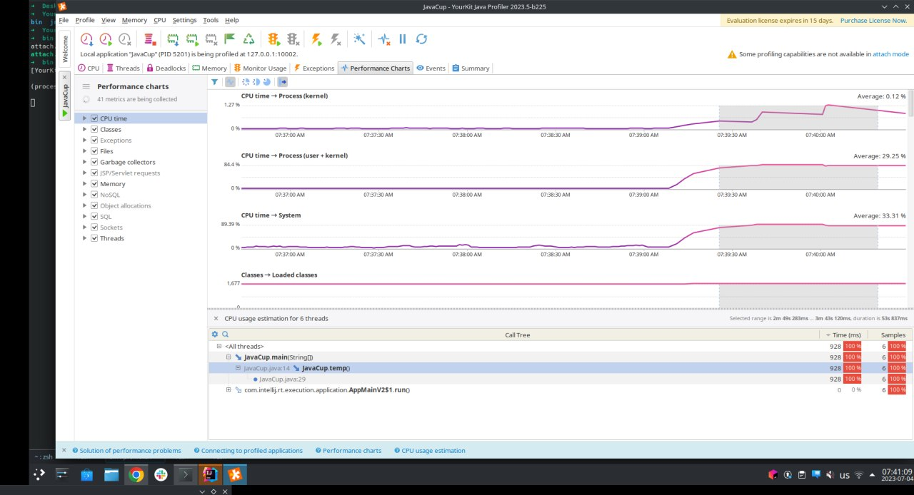
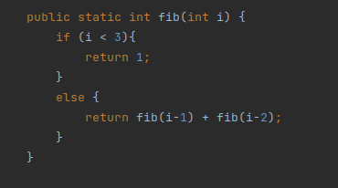
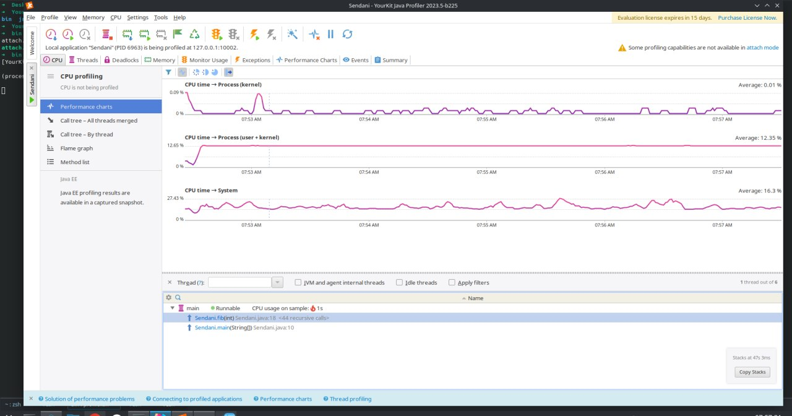
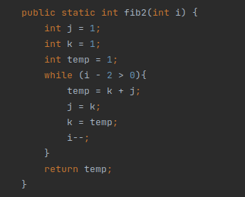
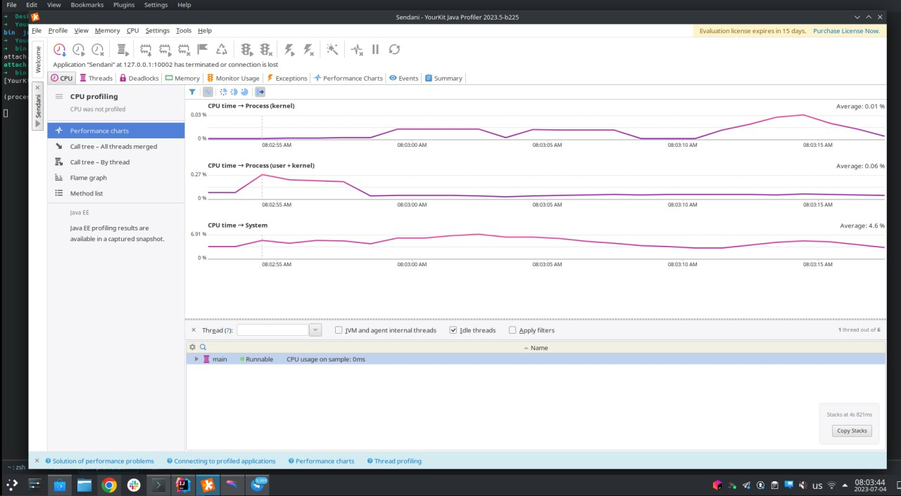

طبق راهنمایی‌های انچام شده، ابزار yourkit نصب و راه‌اندازی شد و به intellij اضافه شد.

تصویر زیر پرفورمنس کد جاوایی داده شده را نشان می‌دهد. همانطور که مشخص است، بیشترین مصرف منابع و زمان برای فانکشن temp است. دلیل آن هم حجم بسیار زیاد for تودرتو است:

در ادامه، قطعه کد ساده‌ای نوشتم که nامین عدد فیبوناچی را با روش بازگشتی حساب کند. قطعه کد:

این قطعه کد به ازای ورودی ۶۰، در عرض ۵ دقیقه هم تمام نشد و پرفورمنس اجرای آن در عکس زیر قابل مشاهده است. میزان مصرف پردازنده به نسبت حالت بعدی به وضوح بیشتر است:

بعد از بهینه کردن کد توسط تابع fib2 و استفاده از برنامه‌نویسی پویا، کد به این شکل شد:

این کد به ازای ورودی ۲۰۰ در زیر ثانیه پاسخ داد و میزان مصرف پردازنده‌ی آن در تصویر زیر قابل مشاهده است. به وضوح این روش بهبود خیلی خوبی نسبت به روش قبلی است و به کمک ابزار yourkit هم این قابل مشاهده است. قله‌ی انتهایی بازه‌ی زمانی، زمانی‌است که عدد ۲۰۰ وارد شده و به سرعت پاسخ داده شده است:

