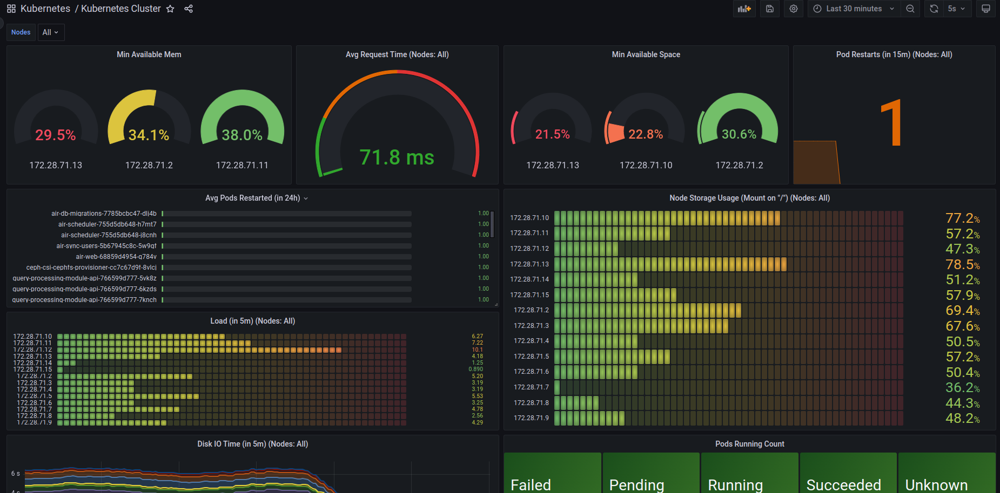
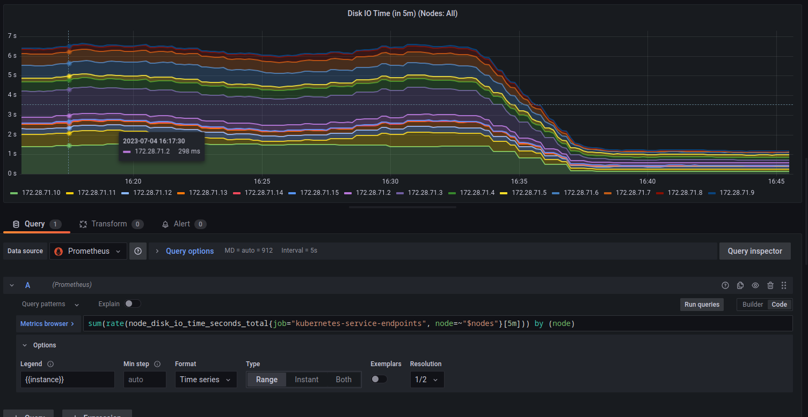

در این گزارش چندین ابزار برای مدیریت درخواست‌ها، حوادث و مشکلات، نحوه کنترل وضعیت و پایش محیط عملیاتی و مدیریت دانش معرفی می‌شوند. ابزارهایی که در این گزارش بررسی می‌شوند عبارتند از:

- Jira
- Promotheus
- Grafana
- Confluence

## ابزار Confluence

این ابزار برای مدیریت دانش استفاده می‌شود. در این ابزار می‌توان spaceهای متفاوت ایجاد کرد و در هرکدام مستندات کافی به همراه تصویر قرار داد.
نمای کلی سامانه به صورت زیر است:

می‌توان اسپیس‌های مختلف ساخت و در آن‌ها عضو شد و سطح دسترسی تعریف کرد:

در هر اسپیس، مستندات به صورت جدول موضوعات تودرتو تعریف می‌شوند:

در هر یک از مستندات، می‌توان به هر شکلی که نیاز است به توسعه‌ی مستند پرداخت:

در بخش کامنت‌ها، افراد سازمان می‌توانند به پرسش و پاسخ حول موضوع بپردازند:

## ابزار promotheus

این ابزار برای مدیریت، نظارت و الرتینگ سامانه‌های نرم‌افزاری استفاده می‌شود. این ابزار به کمک یک http request که از سمت سامانه‌ها به آن ارسال می‌شود، به ما کمک می‌کند که سلامت سرویس‌ها را رصد کنیم.

در این ابزار می‌توان الرت‌های گوناگون ایجاد کرد:

این ابزار ruleهای متفاوتی برای هر ابزار دارد. برای مثال اگر به مدت ۲۰ ثانیه از یک سرویس پاسخی دریافت نشود، می‌توان آن سرویس را ناکارآمد در نظر گرفت و الرت ارسال کرد:

در این ابزار می‌توان دسته‌بندی‌های مختلف ایجاد کرد و تمام سامانه‌های هم‌دسته را به صورت مرتب نظاره کرد:

ابزار promotheus pushgateway به ما کمک می‌کند الرت‌های تعریف شده، به هرجا که نیاز است ارسال شود. مانند ایمیل، بات، یا هرجایی که برای رصد سرویس‌ها مد نظر است:

نمونه‌ی الرت ارسال شده توسط بات اسلک:

## ابزار grafana

این ابزار به ما کمک می‌کند دشبوردهای متفاوتی بسازیم و گراف‌های مرتبط با عملکرد سیستم‌ها را به صورت انواع نمودار به ما نشان می‌دهد

در این ابزار می‌توان گروه‌هایی مرتبط با هر نوع سرویس ایجاد کرد:

در هر گروه، می‌توان دشبوردهای مرتبط با هر نوع نظارتی که نیاز است پیاده کرد. برای مثال پایش سرورها، شبکه و ...

در هر دشبورد هر نوع نموداری که نیاز باشد می‌توان پیاده کرد. اطلاعات این نمودارها، توسط ابزارهایی تحت عنوان exporter به promotheus ارسال می‌شوند و گرافانا دیتا را از آنجا می‌خواند:

برای هر نمودار، می‌توان کوئری‌ای با ویژگی‌های مختلف تعریف کرد. کوئری مرتبط با یک نمودار در پایین عکس قابل مشاهده است:

نمونه‌ی ایراد رصد شده توسط ابزار گرافانا. در این تصویر مقدار پیام‌های ورودی به ابزار apache kafka رصد می‌شود که حوالی ۳ صبح دچار اختلال شده‌اند:

## ابزار Jira

این ابزار برای مدیریت درخواست‌ها و ایرادات استفاده می‌شود. در این ابزار می‌توان برای هر مشکل یا درخواست، یک تیکت تولید کرد و آن را به فردی تخصیص داد. آن فرد وظیفه دارد که آن موضوع را پیگیری کند و در صورت لزوم تیکت را به افراد دیگری تخصیص دهد. به این صورت این ابزار می‌تواند به ما کمک کند تمامی درخواست‌ها را رصد کنیم و به طور ساماندهی‌شده به درخواست‌ها و مشکلات پاسخ دهیم.

در این ابزار می‌توان اسپیس‌های مختلف مرتبط با مسائل گوناگون ایجاد کرد. برای مثال تمام مسائل زیرساختی در یک اسپیس قرار بگیرند و اعضای تیم زیرساخت عضو آن باشند:

نمونه‌ی یک تیکت در این عکس قابل مشاهده است. در این سامانه قابلیت تعیین اولویت، توضیح مشکل، تخصیص به افراد مختلف وجود دارد. در سمت راست تصویر افراد مختلفی که به این تیکت تخصیص داده شده‌اند قابل مشاهده است:

تمامی تیکت‌های هر اسپیس، با هر دسته‌بندی که نیاز است قابلیت دسته‌بندی دارند. برای مثال در تصویر زیر تیکت‌های یک اسپرینت در یک دسته‌بندی قرار گرفته‌اند:

در هر تیکت می‌توان مهارت‌های مورد نیاز برای رفع مشکل را ثبت کرد تا تیکت به فردی که تخصص مربوطه را ندارد تخصیص داده نشود یا کسی که تخصص ندارد خودش تیکت را برای انجام انتخاب نکند. این کار به مدیریت زمان کمک می‌کند:

تمامی پیگیری‌ها و اتفاق‌هایی که از زمان ایجاد تیکت رخ داده، به صورت مستند در زیر هر تیکت مشخص است. در نتیجه جریان کاری هر تیکت کاملا قابل رصد است:

