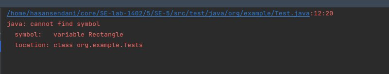
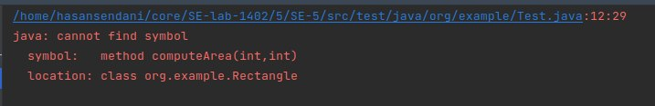
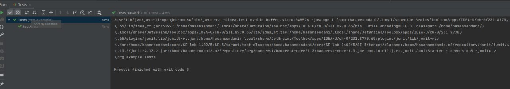
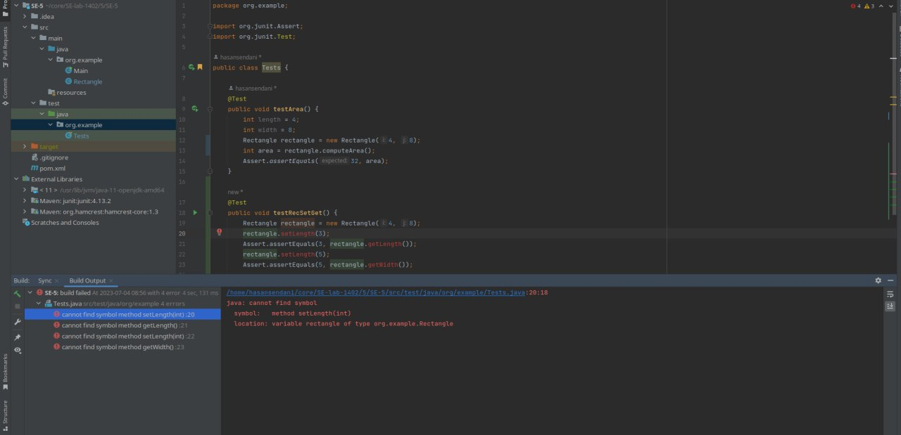
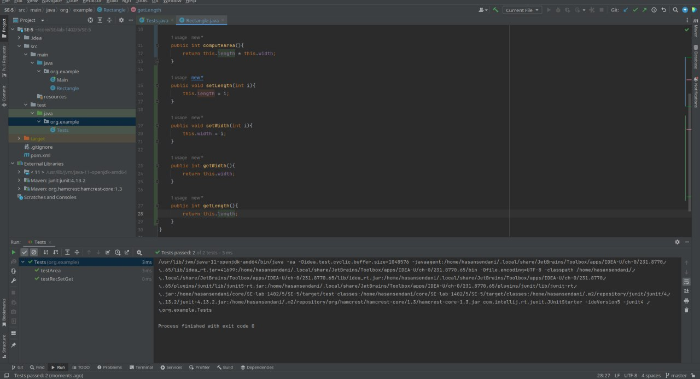
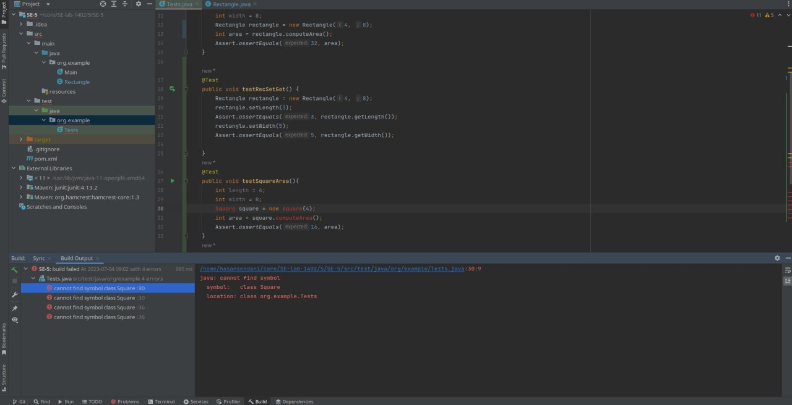
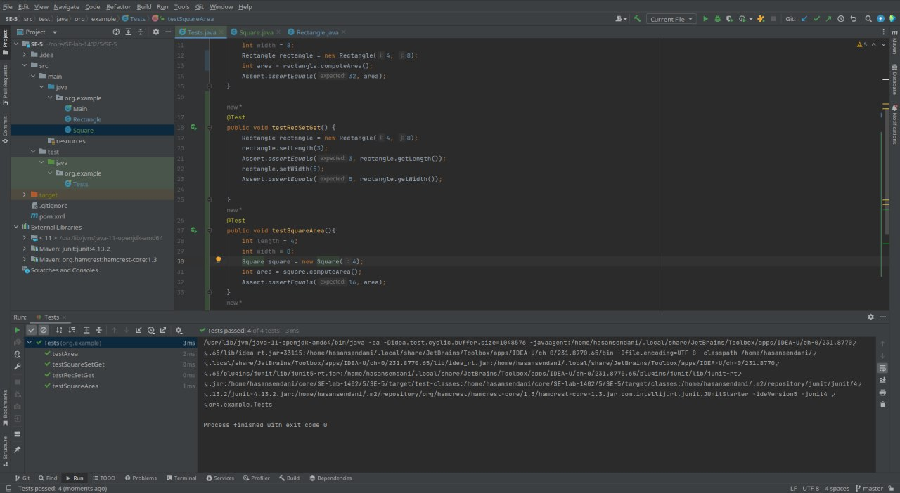

ابتدا فانکشن testArea را پیاده‌سازی می‌کنیم. مشابه تصویر زیر به ارور برمی‌خوریم چرا که کلاس مستطیل موجود نیست:

بعد از ایجاد کلاس، ارور وجود نداشتن فانکشن محاسبه‌ی مساحت می‌گیریم:

با تعریف این فانکشن، تست پاس می‌شود:

حال فانکشن تست testRecSetGet را می‌نویسم. اما با توجه به setter و getter نداشتن کلاس، تست فیل می‌شود:

بعد از اضافه کردن ۴ فانکشن مربوطه، مجددا تست با موفقیت پاس می‌شود:

فانکشن تست testSquareArea و testSquareSetGet را پیاده‌سازی می‌کنیم که هردو فیل می‌شوند:

کلاس مربع را پیاده‌سازی می‌کنیم و فانکشن‌های مربوطه را در آن قرار می‌دهیم. توجه داریم که این کلاس از مستطیل ارث‌بری می‌کند و با توجه به private بودن طول و عرض مستطیل، از setter و getter مستطیل استفاده می‌شود. در نهایت تست پاس می‌شود:

### پاسخ سوال ۱
اصل SRP یا Single Responsibility Principle بیانگر این است که هر کلاس باید دقیقا یک وظیفه انجام دهد و یک کار مشخص داشته باشد. نباید کلاسی باشد که چندین کار را هم‌زمان انجام دهد.

اصل OCP یا Open/Closed Principle بیانگر این است که کلاس‌ها باید طوری توسعه داده شوند که برای توسعه‌ی آینده مشکل‌ساز نباشد. کلاس باید به راحتی قابل توسعه باشد. اما هم‌زمان باید نسبت به تغییرات بی‌جا بسته باشد چرا که تغییر در کدی که کار می‌کند می‌تواند منجر به باگ بشود.

اصل LSP یا Liskov Substitution Principle می‌گوید کلاس والد باید بتواند بدون مشکل جایگزین کلاس‌های فرزند شود. به بیان دیگر در کلاس‌های فرزند نباید فانکشن‌هایی استفاده و پیاده‌سازی شود که به کل نسبت به منطق کلاس والد متفاوت باشد.

اصل ISP یا Interface Segregation Principle بیانگر آن است که نباید تمامی اینترفیس‌ها در اختیار بیرون کلاس قرار بگیرد. تنها کافی‌است چند اینترفیس ضروری به بیرون از کلاس اکسپوز شود و بقیه‌ی کارها توسط خود کلاس هندل شود. توسعه‌دهنده نباید با هزاران اینترفیس مختلف طرف باشد.

اصل DIP یا Dependency Inversion Principle هم بیانگر این است که باید وابستگی بین اجزای نرم‌افزار لایه‌بندی شده باشد. به بیانی نباید یک ماژول بزرگ، در اجرا شدن خود نیازمند بخش‌های کو‌چک‌تر باشد؛ بلکه قسمت‌های کوچک‌تر باید وابسته به قسمت بزرگ‌تر خود باشند.

### پاسخ سوال ۲
اصول سالید با توجه به دید کلی که به قضایا می‌دهد در هر مسئله‌ی نرم‌افزاری قابل تعریف است، اما بیشتر نمود آن در مرحله‌ی طراحی و پیاده‌سازی است. چرا که در این مرحله با توجه به این اصول می‌توان به کل طراحی متفاوتی ایجاد کرد.

### پاسخ سوال ۳
خیر این دو مورد با یکدیگر تناقضی ندارند. در اصل هنگامی که تست‌ها در پایان کار نوشته می‌شوند، یکی از چیزهای مهم میزان پوشش تست‌ها می‌باشد؛ بنابراین در پایان کار تست‌ها به مرور باید دقیق‌تر شوند تا پوشش بیشتری داشته باشند. اما در روش tdd به دلیل توسعه‌ی کلاس‌ها از روی تست، معمولا مسئله‌ی پوشش تست وجود ندارد. بنابراین هر دو روش اگر به صورت اصولی استفاده شوند، برای توسعه‌ی محصول مناسب هستند.
### پاسخ سوال ۴
در این حالت هم می‌توانستیم مربع را از مستطیل به ارث ببریم. اما به جز constructor کلاس تمام آن مشابه والد آن می‌بود. در اصل با توجه به اینکه هیچ تفاوتی در عملکرد کلاس وجود نداشت (در حالت قبلی setter , getter متفاوت بود)، مخالف اصول طراحی شی گرا می‌بود.

